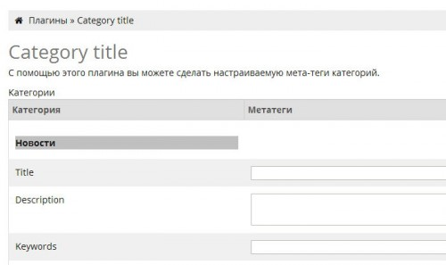

# Плагин «Category title»

## Назначение

Плагин позволяет задавать категориям метатеги title, description и keywords.

## История версий

### 1.2

* Исправлена проблема постоянных запросов в БД при  вызове несколько раз хука
head_meta (два запроса на идин вызов. Для страницы категории происходит три вызова);
* Добавлено поле template для категории, которое доступно в любой части кода
на странице категории через `mso_get_val('category_temlate', false);`
* Также любой параметр текущей категории можно получить в любой части кода:
  * `CategoryTitle::getInstance()->title;` - возвращает title;
  * `CategoryTitle::getInstance()->keywords;` - возвращает keywords;
  * `CategoryTitle::getInstance()->description;` - возвращает description;
  * `CategoryTitle::getInstance()->template;` - возвращает template;
* **Если плагин уже использовался, то после обновления нужно зайти на страницу
плагина в админке и нажать `«сохранить»`.**

### 1.1

Первая публичная версия.
